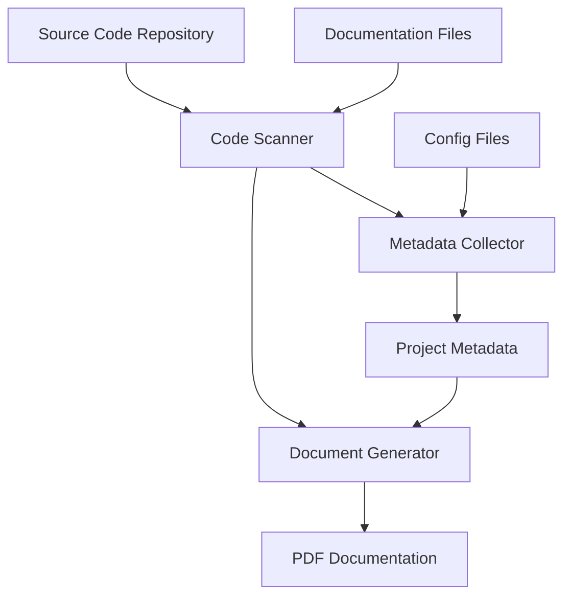
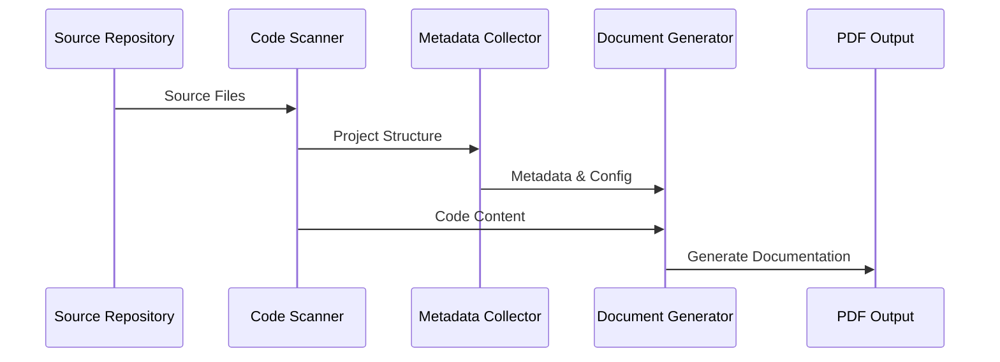

This is a structured template for codeCapture; we need to identify what files we need to generate and in what order they should appear in the PDF.

PDF Structure/Outline:
1. Project Overview (from README.md)
2. Architectural Diagrams (using Mermaid)
3. Metadata Section (from project config files)
4. Directory Structure 
5. Source Code (grouped by components with docstrings)

**Project Overview and Architecture (Template):**

# CodeCapture

## Purpose
CodeCapture is a tool designed to convert codebases into LLM-readable documentation formats. It processes source code repositories and generates structured PDF documentation that maximizes comprehension by Large Language Models.

## Key Features
- Directory structure preservation
- Code content formatting
- Documentation integration
- Metadata collection
- Relationship mapping between components

## Architecture Overview
The system consists of the following main components:

1. **Code Scanner**
   - Traverses directory structure
   - Identifies relevant files
   - Extracts documentation

2. **Document Generator**
   - Formats code and documentation
   - Generates structured PDF output
   - Maintains code relationships

3. **Metadata Collector**
   - Extracts project dependencies
   - Captures environment requirements
   - Collects configuration settings


## Component Relationships

### Example: architectural diagrams




### Example: flow diagram:



---

### Example: metadata section:

# Project Metadata

## Dependencies
```
python = "^3.8"
pypdf2 = "^3.0.0"
pyyaml = "^6.0"
rich = "^13.0.0"
```

## Environment Configuration
Required environment variables:
- OUTPUT_DIR: Directory for generated PDFs
- LOGGING_LEVEL: Debug level for application logs

## Configuration Options
```yaml
scanner:
  exclude_dirs: [".git", "__pycache__", "node_modules"]
  file_types: [".py", ".md", ".yaml", ".txt"]

generator:
  pdf_template: "default"
  include_line_numbers: true
  preserve_formatting: true

metadata:
  collect_dependencies: true
  scan_env_files: true
  include_git_info: true
```

## Directory Structure
```
codecapture/
├── src/
│   ├── scanner/
│   ├── generator/
│   └── metadata/
├── tests/
├── docs/
└── config/
```
---


This gives us a good starting template. Would you like me to continue with:

1. More detailed component documentation using docstrings?
2. Example code sections with proper formatting and comments?
3. Additional relationship diagrams for specific components?

Also, I'd love your feedback on this structure so far - does it align with your vision for CodeCapture? Would you like any adjustments to make it more LLM-friendly?